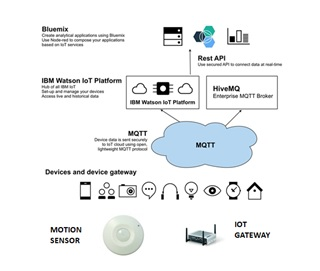
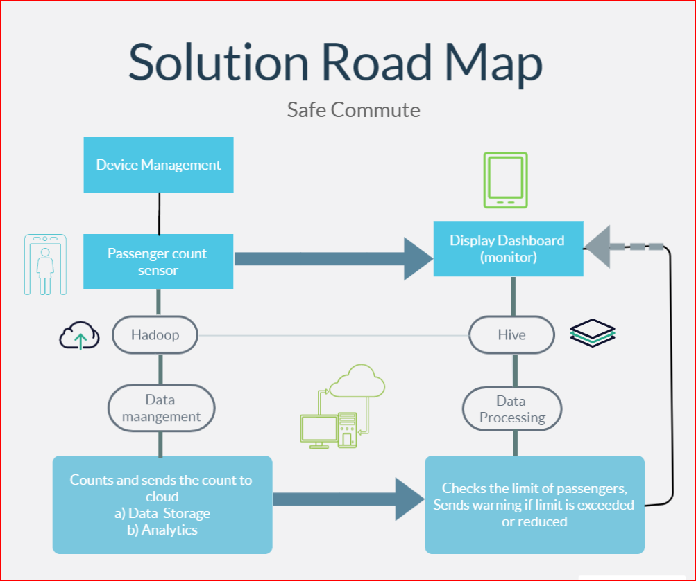

# SafeCommute
The github repository for our Callforcode 2020 submissions.
# Contents
1. Short description
2. Demo video
3. The architecture
4. Long description
5. Project Roadmap
6. Getting started
7. Running the Tests
8. Built with
9. Acknowlegdments

# Short Description
Going back to work, schools, colleges, or anywhere of that sort is to return anytime soon and we need to be prepared, we need to focus on transportation to these locations with safety and preventive measures and not be vulnerable to become potential carriers to the respective locations.

MTC buses are a major source of transportation for a vast population in India. We can always picture an over-crowded bus in the streets of India. With COVID-19 prevailing and the need for social distancing to be implemented in the daily routines of our lives, to achieve the former in buses is going to be a problem that needs to be addressed.

Our project aims to help practice social distancing in MTC buses by installations of sensors on buses to monitor the number of people aboard at regular instances and alarm the government workers in charge of the bus in case the limit is exceeded and also with the help of an application the public has access to regular updates on the number of passengers present in the bus at any point of time so as to make it easier to plan their journey.

# Demo video

<iframe width="560" height="315" src="https://www.youtube.com/embed/6V3EolTyQBI" frameborder="0" allow="accelerometer; autoplay; encrypted-media; gyroscope; picture-in-picture" allowfullscreen></iframe>

# The Architecture

# Long description

A detailed picture of our project can be view in the SAFE COMMUTE ppt uploaded in the reppsitory

# Project roadmap

